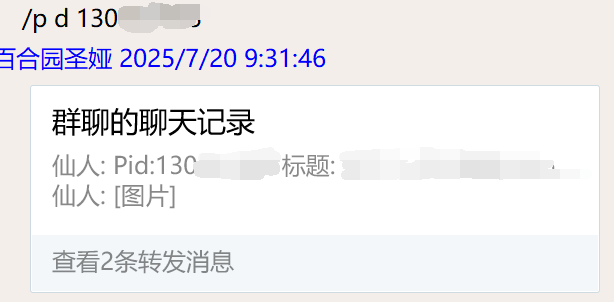
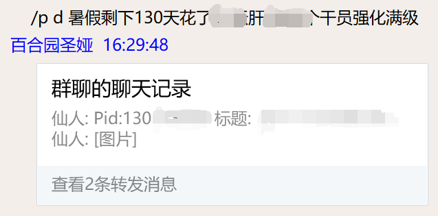

# astrbot_plugins_pixiv
本插件是用于根据提供的pid获取pixiv上面的图片的插件。

## 依赖
本插件是写给qq的bot使用的，且仅在napcat上测试过，建议使用napcat的用户使用。  

在使用本插件之前，你需要自行获取一个pixiv账号的accessToken和refreshToken，没有这两个token该插件无法运行，获取到token之后放入本插件文件夹里面的tokens.jsond当中。  
获取token的方法参考以下url：https://gist.github.com/ZipFile/c9ebedb224406f4f11845ab700124362

获取到token之后，放入tokens.jsond当中，格式如下：
```
{
    "access_token": "your_access_token",
    "refresh_token": "your_refresh_token"
}
```

此外，本插件还需要安装以下依赖：
```angular2html
pip install pixivpy3 --upgrade
```


## 功能/使用方法
目前，本插件主要只有一个功能，即根据提供的pid获取pixiv上面的图片。

- /p d pid(或者包含pid的一串神秘文字)  
根据提供的pid从pixiv上获取图片，并发送到当前聊天窗口，群聊跟私聊都可以。

**下面两个命令都需要管理员权限才能使用：**
- /p promote type name  
提升指定用户或者群组的权限，type为权限类型，name为用户名。  
- /p demote type name  
降低指定用户或者群组的权限，type为权限类型，name为用户名。  
e.g: /p promote user 123456778(qqid)  
-    /p demote group 123456778(groupid)  
**注意：只有添加了权限的用户和群组在查询的时候才会显示预览图，否则只会显示tag之类的信息。**


## 注意事项
- 由于pixivpy3的限制，本插件只能获取到图片的缩略图，有点糊:(  
- 由于发送合并消息的时候也可能会被检测图片，因此在查询到图片后，本插件会给图片上面加上一大片白底来防检测。  

## 使用示例：  
聊天记录里面就不放了，自己试试把



